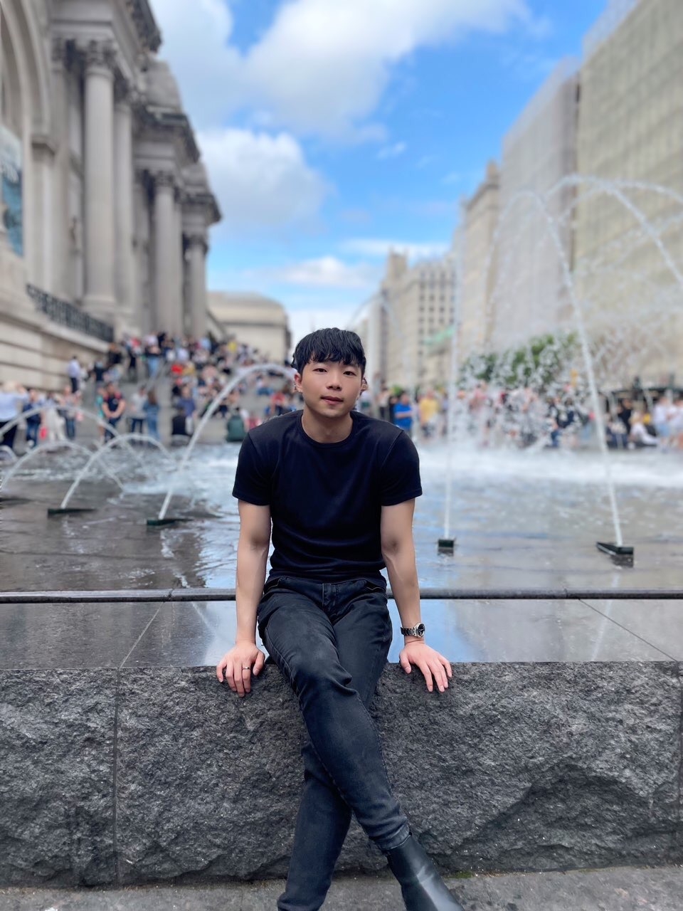

# Welcome! 
$\\$

I’m Hun, my hometown is Busan in South Korea. 

I am currently enrolled in the program of biostatistics in the Mailman School of Public Health at Columbia University. I earned my B.S. in statistics from University of California, Davis. 

I am interested in pursuing my career in research! My research and academic interests lie in the intersection of causal inference, semi-parametric inference, and Bayesian inference. 

I am an inquisitive person motivated by faith, hope, love, and insight. I am also interested in soccer, baseball, cooking, mathematics, Fyodor Dostoyevsky books, and the books of the Bible.

