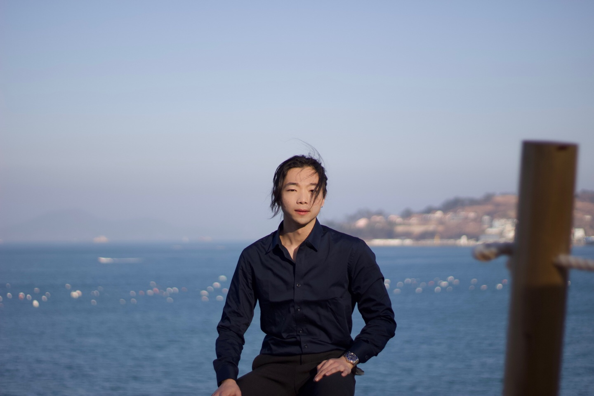

### Welcome! 

I'm Hun, I am a master student in Biostatistics at the Columbia Mailman School of Public Health.

I am from South Korea and I did my undergraduate education in University of California, Davis (Shout out to Aggies) with a degree in statistics. 

I am interested in pursuing my career in research and my research interest is causal inference. I love playing soccer, cooking, finding good teas, eating healthy, finding movies that make you think, and reading the books of the Bible.